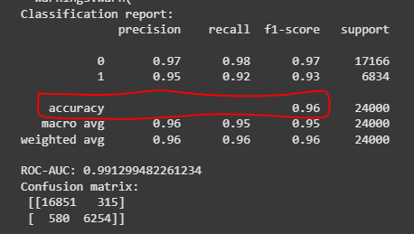
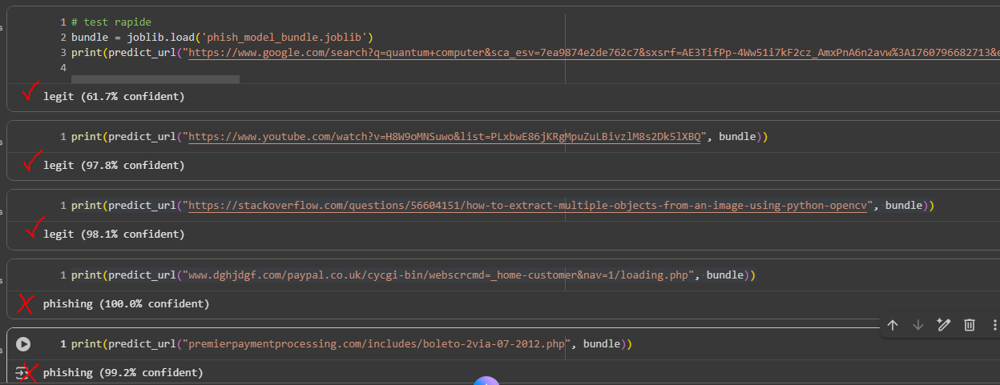

#  Phishing URL Detection – Google Colab Project

## 🎯 Objectif
Ce projet a pour but de **détecter automatiquement les URLs de phishing** à l’aide du **Machine Learning**.  
Le modèle apprend à partir d’un ensemble d’URLs légitimes et malveillantes pour prédire si une URL donnée est **phishing** ou **légitime**.

---

##  Prérequis
Avant de lancer le notebook **PhyshingURLdetection.ipynb**, installez les bibliothèques nécessaires :

```python
!pip install -q scikit-learn pandas numpy matplotlib seaborn lightgbm tldextract joblib
```
📂 Chargement du dataset
Le dataset phishing_site_urls.csv doit être téléchargé depuis votre ordinateur dans Colab  :

```
from google.colab import files
uploaded = files.upload()
```
Ce fichier doit contenir au minimum deux colonnes :

URL : docs.google.com/spreadsheet/viewform?formkey=dE5rVEdSV2pBdkpSRy11V3o2eDdwbnc6MQ

Label (ex. : “bad” pour phishing, “good” pour légitime)

## Étapes principales du projet
1. Préparation et nettoyage
Renommage des colonnes → url, label_raw

Conversion du label en binaire :

bad → 1 (phishing)

tout autre → 0 (légitime)

2. Échantillonnage :
Création d’un sous-échantillon équilibré (par défaut SAMPLE_SIZE = 120000) pour un apprentissage plus rapide.

3. Extraction des caractéristiques lexicales
Chaque URL est analysée pour extraire des features :

Feature	Description
url_len	Longueur de l’URL
domain_len	Longueur du domaine
num_dots	Nombre de “.”
num_slash	Nombre de “/”
has_ip	Présence d’adresse IP
has_dash	Tiret dans le domaine
domain_entropy	Entropie du domaine (aléatoire)

4. TF-IDF sur les n-grammes de caractères
Transformation textuelle des URLs en vecteurs numériques .

5. Fusion et séparation des données
Les caractéristiques lexicales et TF-IDF sont combinées puis séparées en :
80 % données d’entraînement
20 % données de test

6. Entraînement du modèle LightGBM
```
from lightgbm import LGBMClassifier
lgb = LGBMClassifier(n_estimators=300, random_state=42)
lgb.fit(X_train, y_train)
```
Modèle performant pour données textuelles et numériques.

Évaluation : accuracy, F1-score, ROC-AUC, matrice de confusion.

7. Sauvegarde du modèle (pour éviter de relancer l'entrainment à chaque fois)
```
import joblib
model_bundle = {
  'model': lgb,
  'vectorizer': vectorizer,
  'lex_features': lex_features
}
joblib.dump(model_bundle, 'phish_model_bundle.joblib')
```
Le modèle complet est sauvegardé dans un fichier .joblib.

8. Prédiction d’une nouvelle URL
```
def predict_url(url, bundle):
    ...
    return f"{label} ({confidence*100:.1f}% confident)"
```

## 📈 Résultats attendus


- ROC-AUC > 0.95 sur dataset équilibré.

- Rapport de classification détaillé.

- Matrice de confusion claire entre phishing et légitime.

EX: phishing (92.7% confident)
legit (98.4% confident)

## Exemple
- Entrainement
- 
- Test
- 
